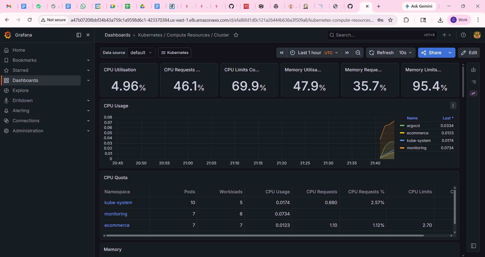
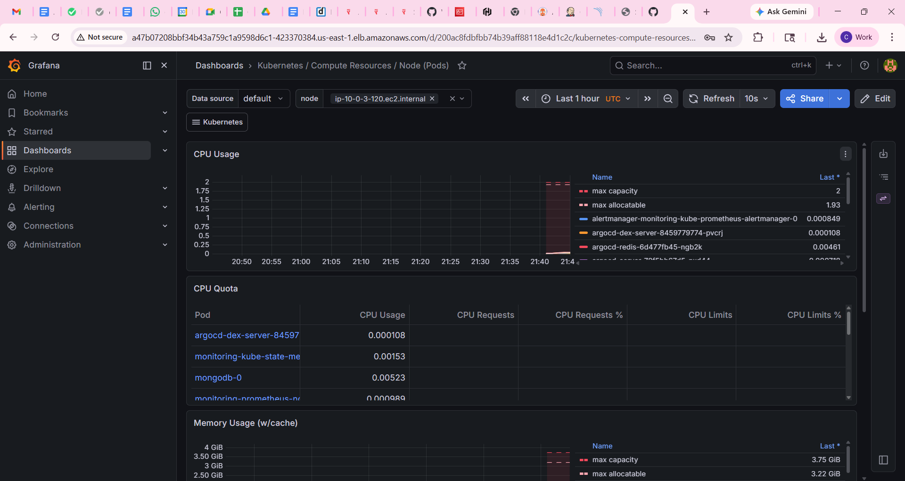
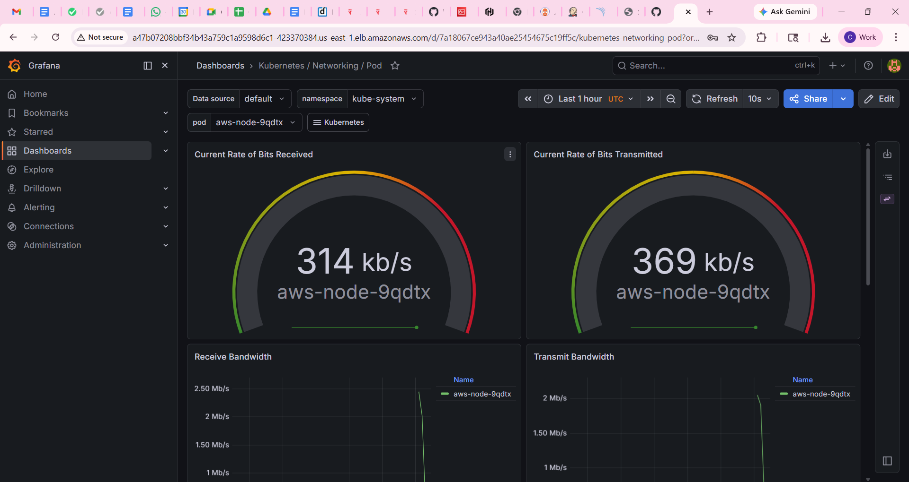

# ShopEasy — End-to-End DevOps + AI Platform on AWS

> A production-grade project demonstrating a complete DevOps pipeline, microservices architecture, GitOps deployment, AI-powered shopping assistant (RAG + Agentic AI), and autonomous AIOps cluster management — all running on AWS EKS.

---

## Table of Contents

1. [What This Project Is](#1-what-this-project-is)
2. [Full Architecture](#2-full-architecture)
3. [Technology Stack & Why Each Tool Was Chosen](#3-technology-stack--why-each-tool-was-chosen)
4. [Two-Repo GitOps Pattern](#4-two-repo-gitops-pattern)
5. [Phase 1 — Infrastructure (Terraform)](#5-phase-1--infrastructure-terraform)
6. [Phase 2 — Jenkins CI Server](#6-phase-2--jenkins-ci-server)
7. [Phase 3 — SonarQube Code Quality](#7-phase-3--sonarqube-code-quality)
8. [Phase 4 — CI Pipeline Deep Dive](#8-phase-4--ci-pipeline-deep-dive)
9. [Phase 5 — EKS & Kubernetes Setup](#9-phase-5--eks--kubernetes-setup)
10. [Phase 6 — ArgoCD GitOps CD](#10-phase-6--argocd-gitops-cd)
11. [Phase 7 — Monitoring (Prometheus + Grafana)](#11-phase-7--monitoring-prometheus--grafana)
12. [Phase 8 — AI Shopping Assistant (RAG + Agentic AI)](#12-phase-8--ai-shopping-assistant-rag--agentic-ai)
13. [Phase 9 — AIOps Agent (Autonomous Cluster Management)](#13-phase-9--aiops-agent-autonomous-cluster-management)
14. [Phase 10 — AI-Powered DevOps Enhancements](#14-phase-10--ai-powered-devops-enhancements)
15. [Microservices Architecture](#15-microservices-architecture)
16. [Complete End-to-End Flow](#16-complete-end-to-end-flow)
17. [Project Screenshots](#17-project-screenshots)
18. [How to Reproduce](#18-how-to-reproduce)
19. [Key Concepts Demonstrated](#19-key-concepts-demonstrated)

---

## 1. What This Project Is

ShopEasy is a fully functional e-commerce platform built as a **hands-on learning project** to understand how every major DevOps and AI engineering concept connects in a real production-like system.

The application itself is a microservices e-commerce store (products, orders, users, notifications). But the application is secondary — the real value is the **complete automated system** around it:

- A developer pushes one line of code → it is automatically compiled, tested, security-scanned, containerized, and deployed to production in Kubernetes — without touching a single server manually
- The production cluster is monitored in real-time by Prometheus and Grafana
- Users can search products using natural language (RAG) and place orders by chatting with an AI agent (Agentic AI)
- The cluster monitors itself — an AI agent reads Prometheus alerts, searches a runbook knowledge base, and autonomously restarts or scales pods when things go wrong (AIOps)

**10 services. 2 GitHub repos. 1 automated pipeline. 5 AI DevOps enhancements. Zero manual deployments.**

---

## 2. Full Architecture

```
┌─────────────────────────────────────────────────────────────────────────┐
│                         DEVELOPER WORKFLOW                              │
│                                                                         │
│  git push → GitHub (ecommerce-app repo)                                 │
│                    │                                                    │
│                    │ Webhook POST /github-webhook/                      │
│                    ▼                                                    │
│  ┌─────────────────────────────────────────────────────────────┐       │
│  │                   JENKINS CI PIPELINE                        │       │
│  │                                                             │       │
│  │  Stage 1: Maven Build & Test   (4 services, parallel)       │       │
│  │  Stage 2: SonarQube Analysis   (4 services, parallel)       │       │
│  │  Stage 3: Quality Gate         (blocks on fail)             │       │
│  │  Stage 4: Docker Build         (8 images, parallel)         │       │
│  │  Stage 5: Trivy Scan + AI CVE Advisor (JSON → Claude)       │       │
│  │  Stage 6: Push to AWS ECR      (8 repos)                    │       │
│  │  Stage 7: Update Config Repo   (new image tags → git push)  │       │
│  │  Stage 8: Post-Deploy Watch    (trigger auto-rollback agent) │       │
│  │  post.failure: AI Build Failure Analyser (Claude diagnosis)  │       │
│  │  post.success: AI Release Notes (Claude → CHANGELOG.md)     │       │
│  └──────────────────────────┬──────────────────────────────────┘       │
└─────────────────────────────│───────────────────────────────────────────┘
                              │ git commit to ecommerce-config repo
                              │
                              ▼ ArgoCD polls every 3 min / webhook
┌─────────────────────────────────────────────────────────────────────────┐
│                         AWS EKS CLUSTER (Kubernetes 1.32)               │
│                         2x t3.medium worker nodes (private subnets)     │
│                                                                         │
│  ┌──────────────────────────────────────────────────────────────────┐  │
│  │  Namespace: ecommerce                                            │  │
│  │                                                                  │  │
│  │  ┌──────────────┐  ┌─────────────────┐  ┌──────────────────┐   │  │
│  │  │  frontend:80 │  │ api-gateway:8080 │  │  mongodb:27017   │   │  │
│  │  │  (Nginx)     │  │ (Spring Cloud   │  │  (StatefulSet    │   │  │
│  │  │  LoadBalancer│  │  Gateway)       │  │   + EBS 10Gi)    │   │  │
│  │  └──────┬───────┘  └───────┬─────────┘  └──────────────────┘   │  │
│  │         │                  │                                     │  │
│  │         │ /api/*           ├──► user-service:8081               │  │
│  │         └──────────────────├──► product-service:8082            │  │
│  │                            ├──► order-service:8083              │  │
│  │                            ├──► notification-service:8084       │  │
│  │                            ├──► ai-service:8085  ◄── RAG+Agent  │  │
│  │                            └──► aiops-service:8086 ◄── AIOps   │  │
│  └──────────────────────────────────────────────────────────────────┘  │
│                                                                         │
│  ┌──────────────────────────┐  ┌──────────────────────────────────┐   │
│  │  Namespace: argocd       │  │  Namespace: monitoring            │   │
│  │  ArgoCD (GitOps engine)  │  │  Prometheus + Grafana            │   │
│  │  Watches config repo     │  │  Scrapes all pods every 15s      │   │
│  │  Auto-deploys on change  │  │  LoadBalancer for Grafana UI     │   │
│  └──────────────────────────┘  └──────────────────────────────────┘   │
└─────────────────────────────────────────────────────────────────────────┘
         │
         │ AWS Infrastructure (all provisioned by Terraform)
         ▼
┌─────────────────────────────────────────────────────────────────────────┐
│  VPC 10.0.0.0/16                                                        │
│  ├─ Public Subnets  (Jenkins EC2, SonarQube EC2, NAT Gateway, ELBs)    │
│  └─ Private Subnets (EKS worker nodes — not directly internet-facing)  │
│                                                                         │
│  AWS ECR (8 private repos)  │  AWS EBS (MongoDB PVC)  │  IAM Roles    │
└─────────────────────────────────────────────────────────────────────────┘
```

---

## 3. Technology Stack & Why Each Tool Was Chosen

Every tool in this project was chosen deliberately. Here is the reasoning behind each decision.

### Infrastructure & Cloud

| Tool | Why This, Not Something Else |
|---|---|
| **AWS** | Industry-standard cloud. EKS, ECR, EBS, IAM, VPC — all native integrations. No glue code needed between services. |
| **Terraform** | Declarative IaC. Write what you want, not how to get there. `terraform destroy` cleans everything in one command. Chosen over CloudFormation because it's cloud-agnostic and has a cleaner HCL syntax. |
| **AWS EKS** | Managed Kubernetes — AWS handles the control plane (API server, etcd, scheduler). You only manage worker nodes. Chosen over ECS because Kubernetes is the industry standard for container orchestration, and skills transfer to any cloud. |
| **AWS ECR** | Private Docker registry native to AWS. No credential management needed — EKS nodes pull images using IAM roles automatically. Chosen over Docker Hub because it's private by default and integrates directly with EKS. |
| **AWS EBS (gp2)** | Block storage for MongoDB persistent volume. EBS is attached to a single node, which is exactly what a single MongoDB StatefulSet needs (ReadWriteOnce). |

### CI/CD

| Tool | Why This, Not Something Else |
|---|---|
| **Jenkins** | Most widely used CI server in enterprises. Self-hosted on EC2 — full control, no per-minute billing. Chosen over GitHub Actions because it demonstrates real server setup and is more common in enterprise DevOps roles. |
| **Apache Maven** | Standard build tool for Java/Spring Boot. Handles compilation, testing, dependency management, and SonarQube integration via the `sonar:sonar` goal. Chosen over Gradle because Maven's lifecycle is more explicit and predictable. |
| **SonarQube** | Performs static code analysis — finds bugs, security vulnerabilities, code smells, and measures test coverage. The **Quality Gate** feature blocks the entire pipeline if code doesn't meet standards. Chosen over manual code review because it's automated, consistent, and catches issues humans miss. |
| **Trivy** | Scans Docker images for CVEs (Common Vulnerabilities and Exposures) in both OS packages and Java JAR dependencies. Chosen over Snyk or Clair because it's free, open-source, fast, and requires no external API calls. |
| **ArgoCD** | GitOps continuous delivery. Watches a git repository and automatically syncs the cluster to match the git state. Chosen over Flux because ArgoCD has a better UI, more intuitive configuration, and is more commonly seen in interviews and job postings. |
| **Docker** | Container runtime. Multi-stage builds keep production images lean (~200MB for Java services vs ~600MB with full JDK). Chosen because it's the universal standard. |

### Application

| Tool | Why This, Not Something Else |
|---|---|
| **Spring Boot 3.2** | Production-ready Java framework. Auto-configures everything (web server, DB connections, metrics). Built-in `/actuator/health` and `/actuator/prometheus` endpoints make Kubernetes probes and monitoring trivial. |
| **Spring Cloud Gateway** | Reactive (WebFlux-based) API gateway. Routes all `/api/**` traffic to correct microservice. Handles CORS centrally so individual services don't need to. Chosen over Nginx as gateway because it's code-configurable and integrates with Spring ecosystem. |
| **MongoDB 7.0** | Document database — flexible schema fits e-commerce (products have varying attributes). Each microservice has its own database (userdb, productdb, orderdb, notificationdb) — this is the **database-per-service** pattern for true microservices independence. Chosen over PostgreSQL because document model suits product catalogs better. |
| **Nginx** | Serves the static frontend (HTML/CSS/JS). Also proxies `/api/` requests to the api-gateway — this means the browser only ever talks to one host, avoiding CORS issues entirely. |

### AI Layer

| Tool | Why This, Not Something Else |
|---|---|
| **Anthropic Claude API** | Powers both the shopping agent and the AIOps agent. Claude's tool use (function calling) API is the cleanest implementation of agentic AI — the model decides which tool to call, calls it, reads the result, and continues. Chosen over OpenAI GPT because Claude has superior instruction following and a cleaner tool use API. |
| **ChromaDB** | Vector database for RAG. Stores embeddings of product descriptions and runbook documents. Enables semantic similarity search — "wireless headphones" finds the Sony WH-1000XM5 even if those exact words don't match. Chosen over Pinecone (paid/external) and FAISS (no persistence) because it's free, self-hosted, and has a simple Python API. |
| **Sentence Transformers (`all-MiniLM-L6-v2`)** | Converts text to 384-dimensional vectors for ChromaDB. This model is 80MB, runs in-container with no API key, and is fast enough for real-time queries. Chosen over OpenAI embeddings (paid per token) because it's completely free and runs locally. |
| **FastAPI** | Python web framework for both AI services. Async by design, automatic OpenAPI docs, Pydantic validation. Chosen over Flask because it's faster, has better async support, and generates API documentation automatically. |
| **Kubernetes Python Client** | Allows the AIOps agent to call the K8s API from inside the cluster — list pods, get logs, restart deployments. Uses the pod's ServiceAccount token automatically. No kubectl binary needed. |

### Monitoring

| Tool | Why This, Not Something Else |
|---|---|
| **Prometheus** | Time-series metrics database. Scrapes `/actuator/prometheus` endpoints from all pods using pod annotations — zero configuration per service. Chosen over Datadog (paid) and CloudWatch (AWS-only, expensive) because it's free, open-source, and the industry standard. |
| **Grafana** | Visualization layer for Prometheus. Pre-built Kubernetes dashboards from `kube-prometheus-stack` show cluster health, pod CPU/memory, network, and JVM metrics out of the box. Chosen over Kibana (ELK-focused) because Grafana is purpose-built for metrics visualization. |
| **kube-prometheus-stack (Helm)** | Single Helm chart that installs Prometheus, Grafana, Alertmanager, node-exporter, and kube-state-metrics together. All pre-configured to scrape Kubernetes metrics. Chosen over manual installation because it wires everything together in one command. |

---

## 4. Two-Repo GitOps Pattern

This project uses **two separate GitHub repositories**. This is a deliberate architectural decision, not convenience.

```
┌──────────────────────────────┐     ┌──────────────────────────────────┐
│  ecommerce-app (Source Repo) │     │  ecommerce-config (Config Repo)  │
│                              │     │                                  │
│  Application code            │     │  Kubernetes manifests only       │
│  Jenkinsfile                 │     │  deployment.yaml per service     │
│  Dockerfiles                 │     │  ArgoCD application.yaml         │
│  Maven pom.xml files         │     │                                  │
│  Python AI service code      │     │  WHO WRITES HERE:                │
│                              │     │  → Jenkins (image tag updates)   │
│  WHO TRIGGERS CI:            │     │  → Humans (config changes)       │
│  → Developer git push        │     │                                  │
│  → Jenkins builds            │     │  WHO READS HERE:                 │
└──────────────────────────────┘     │  → ArgoCD (syncs to cluster)     │
                                     └──────────────────────────────────┘
```

**Why two repos instead of one?**

1. **Separation of triggers**: A code push triggers Jenkins (CI). A manifest change triggers ArgoCD (CD). They are independent systems with independent responsibilities.
2. **No circular triggers**: If both were in one repo, Jenkins pushing image tags would trigger Jenkins again, creating an infinite loop.
3. **Rollback is simple**: To roll back a deployment, revert one commit in the config repo. ArgoCD detects the revert and re-deploys the previous image automatically — no pipeline needed.
4. **Audit trail**: The config repo's git history is a complete log of every deployment: what version, when, by whom (Jenkins).
5. **Access control**: Developers push to the app repo. Only Jenkins writes to the config repo. Humans can still make manual config changes (resource limits, env vars) without touching application code.

---

## 5. Phase 1 — Infrastructure (Terraform)

All AWS resources are defined in `terraform/` and created with a single `terraform apply`.

### Repository Structure
```
terraform/
├── main.tf        # VPC, subnets, EC2s, security groups, ECR repos
├── eks.tf         # EKS cluster, node group, IAM roles for K8s
├── variables.tf   # Input variable definitions
├── outputs.tf     # Jenkins IP, SonarQube IP, ECR base URL, EKS name
└── terraform.tfvars # Actual values (key pair, instance types, scaling)
```

### How the Networking Was Designed

```
AWS Region: us-east-1
│
└─ VPC: 10.0.0.0/16
   │
   ├─ Public Subnet A (10.0.1.0/24) — us-east-1a
   │   ├─ Jenkins EC2 (t3.medium, port 8080 + 22)
   │   ├─ SonarQube EC2 (t3.medium, port 9000 + 22)
   │   └─ NAT Gateway (+ Elastic IP)
   │
   ├─ Public Subnet B (10.0.2.0/24) — us-east-1b
   │   └─ (Load Balancers created by Kubernetes go here)
   │
   ├─ Private Subnet A (10.0.3.0/24) — us-east-1a
   │   └─ EKS Worker Node 1 (t3.medium)
   │
   └─ Private Subnet B (10.0.4.0/24) — us-east-1b
       └─ EKS Worker Node 2 (t3.medium)
```

**Why private subnets for EKS nodes?** Worker nodes don't need to be internet-accessible. Putting them in private subnets reduces the attack surface — they can only receive traffic from the load balancer or other pods. They reach the internet via the NAT Gateway (for pulling Docker images, AWS API calls).

**Why NAT Gateway?** EKS nodes in private subnets need outbound internet access to pull Docker images from ECR and make AWS API calls. NAT Gateway allows outbound traffic from private subnets while blocking inbound traffic from the internet.

### ECR Repositories

Terraform creates 8 ECR repositories using a `for_each` loop — one per service:

```hcl
locals {
  services = [
    "user-service", "product-service", "order-service",
    "notification-service", "api-gateway", "frontend",
    "ai-service", "aiops-service"
  ]
}

resource "aws_ecr_repository" "services" {
  for_each             = toset(local.services)
  name                 = each.key
  image_tag_mutability = "MUTABLE"
  image_scanning_configuration { scan_on_push = true }
}
```

**Why MUTABLE tags?** Each build pushes the same service with a new build number tag (e.g., `user-service:42`). Mutable means old tags can be overwritten if needed.

### IAM Roles (No Stored Credentials)

Jenkins EC2 has an **IAM instance role** attached — not stored AWS access keys. This means:
- Jenkins never has `AWS_ACCESS_KEY_ID` or `AWS_SECRET_ACCESS_KEY` hardcoded anywhere
- The EC2 metadata service provides temporary credentials automatically
- If the role is revoked, access is immediately cut off — no key rotation needed

---

## 6. Phase 2 — Jenkins CI Server

Jenkins runs on the EC2 instance. The full software stack installed:

| Software | Version | Why Needed |
|---|---|---|
| Java 21 (Amazon Corretto) | 21 | Jenkins requires Java 17+ to run |
| Jenkins | LTS | The CI server itself |
| Docker | 24+ | Builds Docker images in the pipeline |
| Apache Maven | 3.9 | Compiles Java services |
| AWS CLI | v2 | Authenticates with ECR, interacts with EKS |
| kubectl | Latest stable | (Optional) Direct K8s commands from Jenkins |
| Trivy | Latest | Container image security scanning |

### Jenkins Pipeline Job Configuration

- **Type**: Pipeline (not Freestyle)
- **SCM**: Git → `https://github.com/Chirag390/ecommerce-app`
- **Branch**: `*/main`
- **Script Path**: `Jenkinsfile` (at repo root)
- **Build Trigger**: GitHub hook trigger for GITScm polling
- **Lightweight checkout**: OFF — needed to read the full Jenkinsfile

### GitHub Webhook

GitHub sends a POST request to `http://<JENKINS_IP>:8080/github-webhook/` on every push. Jenkins receives this, checks if the branch matches, and starts the pipeline. This is how "push → pipeline" happens automatically.

### SonarQube Webhook (Critical)

SonarQube must call back Jenkins with the Quality Gate result. Without this webhook, Jenkins hangs forever waiting for a result that never arrives:

```
SonarQube → Administration → Webhooks → Create
  Name: Jenkins
  URL:  http://<JENKINS_IP>:8080/sonarqube-webhook/
```

---

## 7. Phase 3 — SonarQube Code Quality

SonarQube runs as a Docker container on its own EC2:

```bash
docker run -d --name sonarqube -p 9000:9000 sonarqube:lts-community
```

### What SonarQube Analyses

For each of the 4 Java services, SonarQube checks:

| Dimension | What It Finds | Example |
|---|---|---|
| **Reliability (Bugs)** | Code that will behave incorrectly at runtime | Null pointer dereference, wrong operator |
| **Security (Vulnerabilities)** | Code attackers can exploit | SQL injection, hardcoded credentials |
| **Maintainability (Code Smells)** | Code that is hard to change | Duplicated blocks, overly complex methods |
| **Security Hotspots** | Code that needs manual security review | Using user input in file paths |
| **Coverage** | Percentage of code covered by unit tests | Lines/branches not tested |
| **Duplications** | Copy-pasted code blocks | Same logic in multiple places |

### How the Quality Gate Works

```
Jenkins triggers SonarQube analysis
           │
           ▼
SonarQube analyses code (1-3 minutes)
           │
           ▼ SonarQube sends webhook callback to Jenkins
Jenkins receives: PASS or FAIL
           │
     ┌─────┴─────┐
    PASS         FAIL
     │             │
  Continue      Pipeline
  pipeline      aborts ← No Docker images built, nothing deployed
```

The Quality Gate is the most powerful concept here — **bad code can never reach production** because the pipeline stops before a Docker image is even built.

---

## 8. Phase 4 — CI Pipeline Deep Dive

The `Jenkinsfile` defines 8 stages plus AI-powered `post` blocks. Every git push runs all of them in sequence.

### Stage 1: Maven Build & Test (Parallel)

```
user-service        ─────┐
product-service     ─────┤──► mvn clean package -B
order-service       ─────┤    Runs simultaneously on 4 threads
notification-service─────┘    ~2-3 minutes total
```

`mvn clean package` does:
1. Downloads dependencies (cached after first run)
2. Compiles Java source code
3. Runs unit tests
4. Packages into a JAR file (`target/*.jar`)

If any service fails to compile or any test fails → pipeline stops immediately.

### Stage 2: SonarQube Analysis (Parallel)

```groovy
withSonarQubeEnv('SonarQube') {
    script {
        parallel(
            'user-service': { sh 'mvn sonar:sonar -Dsonar.projectKey=user-service -B' },
            ...
        )
    }
}
```

`withSonarQubeEnv` injects the SonarQube server URL and token automatically from Jenkins configuration — no hardcoded credentials.

### Stage 3: Quality Gate

```groovy
timeout(time: 5, unit: 'MINUTES') {
    waitForQualityGate abortPipeline: true
}
```

Jenkins pauses here and waits for the SonarQube webhook. The 5-minute timeout prevents hanging forever if the webhook is misconfigured.

### Stage 4: Docker Build (Parallel)

All 8 images build simultaneously using multi-stage Dockerfiles:

```dockerfile
# Stage 1 — Build (uses full JDK + Maven)
FROM maven:3.9-eclipse-temurin-21 AS build
WORKDIR /app
COPY pom.xml .
RUN mvn dependency:go-offline -B    # Cache this layer separately
COPY src ./src
RUN mvn clean package -DskipTests -B

# Stage 2 — Run (uses only JRE, much smaller)
FROM eclipse-temurin:21-jre-alpine
WORKDIR /app
COPY --from=build /app/target/*.jar app.jar
EXPOSE 8081
ENTRYPOINT ["java", "-jar", "app.jar"]
```

**Why multi-stage?** Stage 1 image includes Maven, full JDK, all build tools — it's ~600MB. Stage 2 discards all of that and copies only the compiled JAR into a lean JRE Alpine image — result is ~200MB. The build tools never reach production.

### Stage 5: Trivy Security Scan (Sequential)

```groovy
environment {
    TMPDIR = '/var/lib/jenkins/trivy-tmp'  // Avoids 1.9GB tmpfs limit
}
['user-service','product-service',...].each { svc ->
    sh "trivy image --exit-code 0 --severity CRITICAL,HIGH \
        --scanners vuln --cache-dir /var/lib/jenkins/trivy-cache ${svc}:${IMAGE_TAG}"
}
```

**Why sequential, not parallel?** When Trivy runs in parallel, multiple processes write to the same vulnerability database cache simultaneously, causing file lock errors and crashes. Sequential eliminates this race condition.

**Why `--exit-code 0`?** Exit code 1 would fail the pipeline on any CVE found. The open-source images (Alpine, Java JRE) always have some CVEs that are not yet patched upstream. Exit code 0 reports the CVEs in the console log without blocking the pipeline — the security team reviews the output without blocking every deployment.

**Why custom `TMPDIR`?** Trivy writes large temporary files during scanning. The default `/tmp` on the Jenkins EC2 is a `tmpfs` (RAM-backed) filesystem limited to 1.9GB. Large Java images exceed this. Redirecting to `/var/lib/jenkins/trivy-tmp` uses the main EBS disk.

### Stage 6: Push to AWS ECR

```bash
# Authenticate using IAM instance role (no stored credentials)
aws ecr get-login-password --region us-east-1 \
  | docker login --username AWS --password-stdin ${ECR_URL}

# Tag with build number and push
docker tag user-service:${BUILD_NUMBER} ${ECR_URL}/user-service:${BUILD_NUMBER}
docker push ${ECR_URL}/user-service:${BUILD_NUMBER}
```

Each service gets its own ECR repository. The image tag is the Jenkins `${BUILD_NUMBER}` — an auto-incrementing integer. This makes rollback trivial: deploy tag 41 to go back from 42.

### Stage 7: Update GitOps Config Repo

This is the **handoff from CI to CD**:

```bash
git clone https://${GIT_TOKEN}@github.com/Chirag390/ecommerce-config.git

# For each service, update the image tag in deployment.yaml
sed -i 's|image: ECR_URL/user-service:.*|image: ECR_URL/user-service:42|' \
    config-repo/k8s/user-service/deployment.yaml

git commit -m "CI: update all images to tag 42 [skip ci]"
git push
```

`[skip ci]` in the commit message prevents GitHub from triggering another Jenkins build on this config-repo push (if Jenkins were watching it).

ArgoCD detects this new commit within 3 minutes and begins deploying the new images.

---

## 9. Phase 5 — EKS & Kubernetes Setup

### Connecting to the Cluster

```bash
aws eks update-kubeconfig --region us-east-1 --name devops-demo-cluster
```

This writes the cluster credentials to `~/.kube/config`. After this, all `kubectl` commands target the EKS cluster.

### EBS CSI Driver — Why It's Required

MongoDB uses a `StatefulSet` with a `PersistentVolumeClaim`. The PVC requests an EBS volume from AWS. Without the EBS CSI (Container Storage Interface) driver, Kubernetes doesn't know how to provision EBS volumes — the PVC stays in `Pending` forever.

```bash
aws eks create-addon --cluster-name devops-demo-cluster --addon-name aws-ebs-csi-driver
```

**The IMDS Hop Limit Problem**: The EBS CSI controller runs inside a Kubernetes pod (container). To authenticate with AWS, it calls the EC2 Instance Metadata Service (IMDS). By default, the IMDS hop limit is 1, meaning only the EC2 instance itself can call it (1 network hop). A container is 2 hops away. The fix:

```bash
aws ec2 modify-instance-metadata-options \
  --instance-id <NODE_ID> \
  --http-put-response-hop-limit 2 \
  --http-endpoint enabled
```

### MongoDB StatefulSet vs Deployment

MongoDB uses a `StatefulSet`, not a `Deployment`. The difference:

| Aspect | Deployment | StatefulSet |
|---|---|---|
| Pod names | Random (nginx-7d9f4b-xkz2) | Stable (mongodb-0, mongodb-1) |
| Storage | Shared or ephemeral | Each pod gets its own persistent volume |
| Scaling | Any order | Ordered (0 first, then 1) |
| Use case | Stateless apps | Databases, message queues |

MongoDB needs stable storage (data survives pod restarts) and a stable hostname (`mongodb-0`) so other services can connect to it reliably.

The `storageClassName: gp2` in the volumeClaimTemplate explicitly tells the EBS CSI driver which AWS EBS type to provision. Without this, Kubernetes uses the default storage class, which may not be configured correctly.

---

## 10. Phase 6 — ArgoCD GitOps CD

### How ArgoCD Works

ArgoCD is installed in the `argocd` namespace on EKS. It continuously compares two states:
- **Desired state**: what the `ecommerce-config` git repo says should be running
- **Live state**: what is actually running in the `ecommerce` namespace

When these differ (because Jenkins pushed new image tags), ArgoCD applies the git manifests to the cluster — effectively running `kubectl apply` on every changed file.

### ArgoCD Application Configuration

```yaml
source:
  repoURL: https://github.com/Chirag390/ecommerce-config.git
  targetRevision: main
  path: k8s
  directory:
    recurse: true        # Scans k8s/user-service/, k8s/product-service/, etc.

syncPolicy:
  automated:
    prune: true          # Deletes K8s resources that are removed from git
    selfHeal: true       # Reverts manual kubectl changes back to git state
  syncOptions:
    - CreateNamespace=true
```

**`recurse: true`** — Without this, ArgoCD only reads files in the `k8s/` root directory. It misses subdirectories like `k8s/user-service/deployment.yaml`. This was a real issue hit during the project — ArgoCD only synced the `namespace.yaml` and ignored all deployments.

**`selfHeal: true`** — This enforces GitOps discipline. If an engineer manually runs `kubectl scale deployment user-service --replicas=3`, ArgoCD detects the drift and reverts it back to 1 (what git says). Git is the single source of truth — no manual changes survive.

**`prune: true`** — If you delete a service's manifest from git, ArgoCD deletes the corresponding Kubernetes resource. Without this, deleted services would keep running indefinitely.

### Kubernetes Rolling Update Process

When ArgoCD applies a new `deployment.yaml` with an updated image tag:

```
Old Pod (image:41) — Running and serving traffic
     │
     ▼ Kubernetes starts new pod
New Pod (image:42) — Starting...
     │
     ▼ Readiness probe: GET /actuator/health → 200 OK
New Pod (image:42) — Ready ✓
     │
     ▼ Traffic switches to new pod
Old Pod (image:41) — Terminated
```

At no point are both old and new pods serving traffic simultaneously unless configured with `maxSurge > 0`. The readiness probe ensures the new pod only receives traffic after the application has fully started.

---

## 11. Phase 7 — Monitoring (Prometheus + Grafana)

### Installation

```bash
helm install monitoring prometheus-community/kube-prometheus-stack \
  --namespace monitoring --create-namespace \
  --set grafana.service.type=LoadBalancer
```

This single Helm command installs:
- **Prometheus**: Scrapes metrics from all pods every 15 seconds
- **Grafana**: Visualizes Prometheus data in dashboards
- **Alertmanager**: Routes alerts to email/Slack/PagerDuty
- **kube-state-metrics**: Exposes K8s object state (pod restarts, deployment status)
- **node-exporter**: Exposes node-level metrics (CPU, memory, disk, network)

### How Prometheus Discovers Pods Automatically

Each Spring Boot deployment has pod annotations:

```yaml
annotations:
  prometheus.io/scrape: "true"
  prometheus.io/path:   "/actuator/prometheus"
  prometheus.io/port:   "8081"
```

Prometheus reads these annotations using its `kubernetes_sd_configs` — it scans all pods in the cluster, finds ones with `scrape: "true"`, and adds them as scrape targets automatically. **No manual Prometheus configuration needed per service.**

### What Spring Boot Exposes at `/actuator/prometheus`

The `micrometer` library (included in Spring Boot Actuator) automatically exposes 200+ metrics:

```
# JVM metrics
jvm_memory_used_bytes{area="heap"} 125829120
jvm_gc_pause_seconds_sum 0.047

# HTTP metrics
http_server_requests_seconds_count{method="GET",uri="/api/products"} 1523
http_server_requests_seconds_sum{method="GET",uri="/api/products"} 4.21

# MongoDB connection pool
mongodb_driver_pool_size{state="inUse"} 2
```

Grafana queries Prometheus for these metrics and displays them in real-time dashboards. The cluster dashboard visible in the screenshots shows all 4 namespaces (argocd, ecommerce, kube-system, monitoring) with live CPU and memory usage.

---

## 12. Phase 8 — AI Shopping Assistant (RAG + Agentic AI)

This is a new Python `ai-service` (FastAPI, port 8085) added to the microservices stack.

### What It Does

Users chat with "ShopBot" — a floating chat bubble on the frontend. They can say things like:
- *"Find me wireless headphones under $400"* → RAG semantic search
- *"What did I order last time?"* → Agent calls order-service
- *"Order the cheapest laptop for me"* → Agent calls product-service + order-service
- *"Recommend something based on my history"* → Agent uses past orders as RAG context

### How RAG Works Here

**RAG = Retrieval-Augmented Generation.** Instead of relying on the LLM's training data (which doesn't know your products), you retrieve relevant data at query time and include it in the prompt.

```
Step 1 — INDEX (on startup)
  product-service API → returns 8 products
  Each product text: "MacBook Pro 14 Apple M3 chip Electronics $1999"
  sentence-transformers encodes → 384-dimensional vector
  ChromaDB stores: vector + metadata (id, name, price, category)

Step 2 — QUERY (on user search)
  User: "something for running in cold weather"
  sentence-transformers encodes query → query vector
  ChromaDB: cosine similarity search → finds Nike Air Max 270 (most similar)
  Returns: top 3 most semantically similar products

Step 3 — GENERATE
  Claude receives: [retrieved products] + [user query]
  Claude generates: "Based on your need for cold-weather running,
                    I'd recommend the Nike Air Max 270 ($149.99)..."
```

**Why sentence-transformers instead of OpenAI embeddings?**
- Runs locally inside the container — no API call, no cost, no latency
- `all-MiniLM-L6-v2` is 80MB, fast, and produces high-quality embeddings for short texts
- Pre-downloaded in the Dockerfile so startup is instant

**Why ChromaDB instead of Pinecone?**
- Pinecone requires an external API and has usage costs
- ChromaDB runs in-memory inside the Python process — zero infrastructure needed
- For the scale of this project (8 products, 4 runbooks), in-memory is perfectly sufficient

### How the Agentic AI Works

**Agentic AI** means the LLM doesn't just generate text — it decides which actions to take, takes them, reads the results, and continues until the task is complete.

```python
# Tool definitions tell Claude what it can do
tools = [
    {"name": "search_products", "description": "Search catalog with natural language"},
    {"name": "place_order",     "description": "Place an order for a product"},
    {"name": "get_orders",      "description": "Get user's order history"},
    ...
]

# The agentic loop
while True:
    response = claude.messages.create(model=..., tools=tools, messages=messages)

    if response.stop_reason == "end_turn":
        return response.content[0].text     # Final answer

    if response.stop_reason == "tool_use":
        for tool_call in response.content:
            result = execute_tool(tool_call.name, tool_call.input)
            # Feed result back to Claude
        messages.append(tool_results)
        # Loop continues — Claude decides what to do next
```

**Example agent trace for "Order the cheapest laptop":**
```
User: "Order the cheapest laptop for me"
  → Claude decides: call search_products("laptop")
  → Result: [MacBook Pro $1999, ...]
  → Claude decides: call place_order(userId, macbook_id)
  → Result: {orderId: "abc123", success: true}
  → Claude responds: "Done! I ordered the MacBook Pro 14" for $1,999. Order ID: abc123"
```

Claude autonomously chained 2 tool calls to complete a multi-step task — this is the defining characteristic of an AI agent.

### Service Code Structure

```
ai-service/
├── app/
│   ├── main.py      FastAPI app, startup indexing, HTTP endpoints
│   ├── rag.py       ChromaDB + sentence-transformers (index & search)
│   ├── tools.py     6 tool implementations (HTTP calls to microservices)
│   ├── agent.py     Claude agentic loop with tool use
│   └── config.py    Environment variables (API keys, service URLs)
├── requirements.txt
└── Dockerfile       Pre-downloads embedding model for fast startup
```

### API Endpoints

| Endpoint | Method | What It Does |
|---|---|---|
| `/api/ai/chat` | POST | Runs the full agent loop, returns natural language response |
| `/api/ai/search` | POST | RAG-only semantic product search, returns ranked products |
| `/api/ai/reindex` | POST | Re-fetches products from product-service and re-indexes in ChromaDB |
| `/api/ai/health` | GET | Health check for K8s readiness probe |

---

## 13. Phase 9 — AIOps Agent (Autonomous Cluster Management)

This is a new Python `aiops-service` (FastAPI, port 8086). It brings AI into the DevOps layer itself.

### What It Does

When something goes wrong in the Kubernetes cluster — a pod crashes, CPU spikes, a pod is stuck pending — the AIOps agent:

1. Receives the alert (from Prometheus Alertmanager webhook)
2. Retrieves the relevant runbook from its knowledge base using RAG
3. Reads pod logs and describes the pod using the Kubernetes API
4. Queries Prometheus for supporting metrics
5. Decides on a remediation action (restart, scale, or notify)
6. Executes the action autonomously
7. Posts a summary notification via notification-service

### How the Runbook RAG Works

```
INDEX (on startup)
  4 markdown runbooks: crashloopbackoff.md, high_cpu.md, pod_pending.md, oom_killed.md
  Each document embedded → vector stored in ChromaDB

ON ALERT: "user-service CrashLoopBackOff, 7 restarts"
  Query: "CrashLoopBackOff pod restarting"
  ChromaDB returns: crashloopbackoff.md (most similar)
  Runbook content passed to Claude as context
```

The runbooks contain diagnostic steps, common causes, and resolution procedures. The LLM reads the runbook + actual pod logs + Prometheus metrics and makes a context-aware decision — not just a generic response.

### Kubernetes RBAC for the AIOps Agent

The agent runs inside a pod and needs to call the Kubernetes API. It uses a `ServiceAccount` with a `ClusterRole` that grants exactly the permissions it needs:

```yaml
rules:
  - apiGroups: [""]
    resources: ["pods", "pods/log", "events"]
    verbs: ["get", "list", "watch"]        # Read-only for pods
  - apiGroups: ["apps"]
    resources: ["deployments", "deployments/scale"]
    verbs: ["get", "list", "patch", "update"]  # Can restart/scale
```

**Principle of least privilege** — the agent can read pods and restart deployments, but cannot delete resources or modify secrets.

### Example AIOps Agent Trace

```
Alert received: {alertname: "KubePodCrashLooping", pod: "user-service-7d9f4b-xkz2"}

Agent → list_pods()
  Result: user-service pod: 8 restarts, not ready

Agent → search_runbook("CrashLoopBackOff pod restarting repeatedly")
  Result: crashloopbackoff.md → "Common cause: MongoDB connection refused on startup"

Agent → get_pod_logs("user-service-7d9f4b-xkz2")
  Result: "MongoTimeoutException: Timeout while receiving message... Connection refused"

Agent → query_prometheus("kube_pod_container_status_restarts_total{pod='user-service...'}")
  Result: restarts=8, started 4 minutes ago

Agent thinks: "Logs confirm MongoDB connection issue. Runbook says wait and restart.
              MongoDB is now Running. Will restart the deployment."

Agent → restart_deployment("user-service")
  Result: {success: true, message: "Deployment user-service restarted"}

Agent → notify_team("user-service CrashLoopBackOff resolved: MongoDB connectivity
                     confirmed, deployment restarted. 8 previous restarts.")
```

The entire analysis and remediation happened without human intervention.

### Service Code Structure

```
aiops-service/
├── app/
│   ├── main.py              FastAPI app, webhook receiver, health check
│   ├── rag.py               Runbook indexing + semantic search
│   ├── agent.py             Claude agentic loop with K8s + Prometheus tools
│   ├── k8s_client.py        Kubernetes Python client (pods, logs, restart, scale)
│   ├── prometheus_client.py PromQL query execution via HTTP API
│   ├── config.py            Prometheus URL, namespace, API key config
│   └── runbooks/
│       ├── crashloopbackoff.md
│       ├── high_cpu.md
│       ├── pod_pending.md
│       └── oom_killed.md
├── requirements.txt
└── Dockerfile
```

### Prometheus Alertmanager Integration

Configure Alertmanager to send alerts to the aiops-service:

```yaml
# alertmanager config
receivers:
  - name: aiops
    webhook_configs:
      - url: http://aiops-service:8086/api/aiops/webhook
```

For manual testing, use the `/api/aiops/analyse` endpoint to send a synthetic alert.

---

## 14. Phase 10 — AI-Powered DevOps Enhancements

Five Claude-powered enhancements were added directly into the CI/CD pipeline and the `aiops-service` runtime. Together they make the DevOps pipeline itself intelligent — diagnosing failures, auditing security, generating documentation, protecting deployments, and right-sizing the cluster autonomously.

```
Jenkins Pipeline (with AI layers)
─────────────────────────────────
git push
  │
  ├─ Stage 5:  Trivy JSON → AI CVE Advisor   (Enhancement 2)
  ├─ Stage 8:  Post-Deploy Watch trigger     (Enhancement 3)
  ├─ post.failure: AI Build Failure Analyser (Enhancement 1)
  └─ post.success: AI Release Notes          (Enhancement 4)

aiops-service (running in EKS)
────────────────────────────────
  Every 1 hour: Predictive Scaling Agent    (Enhancement 5)
  On POST from Jenkins: Auto-Rollback watcher (Enhancement 3)
```

---

### Enhancement 1 — AI Build Failure Analyser

**File:** [`scripts/ai_build_analyser.py`](scripts/ai_build_analyser.py)  
**Trigger:** `post { failure { ... } }` in Jenkinsfile — fires automatically on any pipeline failure

**What it does:** When a Jenkins build fails, the last 8,000 characters of the console log are sent to Claude Haiku. Claude identifies the root cause, provides the exact fix (file, line, command), suggests prevention, and assigns a severity level.

**Output format:**
```
ROOT CAUSE:
Maven cannot resolve dependency org.springframework.boot:spring-boot-starter:3.2.5
because the Jenkins EC2 has no internet access to Maven Central.

EXACT FIX:
Add a Maven mirror in /opt/maven/conf/settings.xml pointing to your Nexus/Artifactory,
or open outbound TCP 443 in the Jenkins security group.

PREVENTION:
Cache Maven dependencies in a local repository manager to eliminate external network
dependencies in the build environment.

SEVERITY: HIGH
```

**Why the last 8,000 chars?** Build logs can be megabytes long. The actual error is always near the end (Maven prints the failure reason last). Truncating to the tail avoids token limits while keeping the most relevant content.

**How the Jenkinsfile wires it:**
```groovy
post {
    failure {
        sh '''
            pip3 install -q anthropic
            LOG_PATH="/var/lib/jenkins/jobs/${JOB_NAME}/builds/${BUILD_NUMBER}/log"
            python3 scripts/ai_build_analyser.py "$LOG_PATH" || true
        '''
    }
}
```

The `|| true` ensures the AI analysis step never fails the build itself — it's informational only.

---

### Enhancement 2 — AI CVE Security Advisor

**File:** [`scripts/ai_cve_advisor.py`](scripts/ai_cve_advisor.py)  
**Trigger:** Runs at the end of Stage 5 (Trivy Security Scan), immediately after all 8 images are scanned

**What changed in Trivy stage:** Trivy now outputs JSON reports in addition to console output:
```bash
trivy image --format json \
    --output /tmp/trivy-reports/trivy-${svc}.json \
    ${svc}:${IMAGE_TAG}
```

**What the CVE Advisor does:** Reads all 8 `trivy-*.json` files, extracts CRITICAL and HIGH CVEs, sorts them by severity then CVSS score, and sends the top 25 to Claude for a prioritised remediation plan.

**Claude's output format:**
```
IMMEDIATE ACTION REQUIRED (CRITICAL CVEs):
- CVE-2024-1234 in user-service (eclipse-temurin:21-jre-alpine) — log4j 2.17.0
  Fix: Change FROM eclipse-temurin:21-jre-alpine to eclipse-temurin:21.0.3-jre-alpine

HIGH PRIORITY (fix in next sprint):
- CVE-2024-5678 in api-gateway — Spring Framework 6.1.5
  Fix: Bump spring-boot.version to 3.3.0 in pom.xml

BASE IMAGE RECOMMENDATIONS:
- Replace eclipse-temurin:21-jre-alpine with eclipse-temurin:21.0.3_9-jre-alpine (all Java services)

OVERALL RISK ASSESSMENT:
3 critical CVEs across 2 services. Immediate patching required for user-service
before next release window. None of the CVEs are remotely exploitable in this
network configuration, but they will fail compliance audits.
```

**Why only the top 25?** A typical scan finds 50-200 CVEs. Sending all of them would exceed token limits and add noise. The 25 highest-severity CVEs drive 90% of the actual risk.

---

### Enhancement 3 — AI Auto-Rollback

**Files:** [`aiops-service/app/auto_rollback.py`](aiops-service/app/auto_rollback.py) (watcher logic), [`aiops-service/app/main.py`](aiops-service/app/main.py) (endpoint)  
**Trigger:** Jenkins Stage 8 calls `POST /api/aiops/post-deploy-watch` after ArgoCD sync

**Full flow:**
```
Jenkins Stage 8: curl POST /api/aiops/post-deploy-watch
                 {image_tag: "42", watch_minutes: 5}
                        │
                        ▼ (runs async in background — Jenkins continues)
aiops-service: wait 60s (traffic shifts to new pods)
                        │
                        ▼ snapshot baseline metrics
                        │
              ┌── every 60s for 5 minutes ──┐
              │  snapshot: error_rate        │
              │             p95_latency_s    │
              │             pod_restarts     │
              └─────────────────────────────┘
                        │
                        ▼ send baseline + 5 samples to Claude
                Claude decides: KEEP or ROLLBACK
                        │
             ┌──────────┴──────────┐
            KEEP                ROLLBACK
             │                    │
          Log "healthy"    GET ArgoCD history
                           Find previous revision ID
                           POST /api/v1/applications/ecommerce-app/rollback
```

**Claude's decision rules** (hardcoded in the prompt):
- Error rate increased **5× baseline** → ROLLBACK
- P95 latency increased **3× baseline** → ROLLBACK
- Pod restarts **> 3 in 5 minutes** → ROLLBACK
- Otherwise → KEEP

**Why async?** The Jenkins pipeline should not block for 6+ minutes waiting for the rollback watcher. Stage 8 fires the request and moves on. The watcher runs inside the EKS pod entirely independently.

**Why Claude instead of threshold alerts?** Thresholds are brittle — a 5× error rate spike that lasts 2 seconds is very different from one that lasts 5 minutes. Claude can reason about the trend across all 5 samples holistically, weigh which metric matters more, and express confidence percentage. A Prometheus alert rule cannot do this.

**ArgoCD integration:** The rollback uses ArgoCD's REST API, which reverts the application to the previous sync revision — the same as clicking "Rollback" in the ArgoCD UI. This guarantees the cluster state returns to exactly what git had for the previous build.

---

### Enhancement 4 — AI Release Notes Generator

**File:** [`scripts/ai_release_notes.py`](scripts/ai_release_notes.py)  
**Trigger:** `post { success { ... } }` in Jenkinsfile — fires only when the full pipeline passes

**What it does:** Reads git commit log and diff stats since the last release, identifies which microservices changed, sends this to Claude, and gets back structured markdown release notes that are prepended to `CHANGELOG.md`.

**How git data is extracted:**
```python
# Commits since last release
git log HEAD~1..HEAD --oneline --no-merges --format="%h %s (%an)"

# Which files changed
git diff --name-only HEAD~1..HEAD
# → "user-service/src/main/java/..." → service "user-service"

# Diff statistics
git diff --stat HEAD~1..HEAD
# → "42 files changed, 318 insertions(+), 21 deletions(-)"
```

**Claude's output:**
```markdown
## Release #42 — 2026-04-30

### Services Updated
- user-service
- order-service

### Changes
#### New Features
- Added JWT token refresh endpoint to user-service (#user-service)

#### Bug Fixes
- Fixed order status not updating when payment fails (#order-service)

#### Improvements
- Reduced MongoDB connection pool size from 50 to 20 for lower memory usage

### Deployment Notes
> No schema migrations required. Both services are backwards-compatible.
> Safe to deploy without maintenance window.
```

**The CHANGELOG commit:** After generating the notes, the Jenkinsfile commits `CHANGELOG.md` back to the source repo with `[skip ci]` to prevent an infinite pipeline loop.

---

### Enhancement 5 — Predictive Scaling Agent

**File:** [`aiops-service/app/predictive_scaler.py`](aiops-service/app/predictive_scaler.py)  
**Trigger:** APScheduler fires `run()` every 1 hour inside the `aiops-service` pod

**What it does:** Collects current CPU/memory metrics and 30-minute CPU trend data from Prometheus across all pods. This data is fed to Claude which uses **tool use (agentic loop)** to decide whether to scale any deployment up or down.

**The agentic loop:**
```python
# Claude has two tools available:
tools = [
    scale_deployment(deployment_name, replicas, reason),  # executes kubectl scale
    no_action_needed(summary)                              # logs healthy state
]

# Claude runs the loop:
# 1. Receives: full metrics JSON (pod list, CPU now, memory now, 30m trend)
# 2. Analyses: "order-service CPU trending 65% → 72% over 30 min"
# 3. Calls:    scale_deployment("order-service", 2, "CPU trending toward 70% threshold")
# 4. Gets:     {success: true, replicas: 2}
# 5. Continues: checks remaining services
# 6. Calls:    no_action_needed("user-service CPU stable at 12%...")
```

**Scaling rules Claude follows** (in the system prompt):
- CPU trending toward **> 70%** → scale UP to 2 replicas (pre-emptive, before saturation)
- CPU **< 5% for entire 30-minute window** → scale DOWN to 1 replica (cost saving)
- Never scale: `mongodb-0`, `aiops-service`, `ai-service` (stateful or self-referential)
- Maximum replicas: 3 (prevents runaway scaling)

**Why predictive (trend-based) instead of reactive (threshold-based)?** Reactive scaling waits until the problem happens — users experience high latency during the scale-up lag. Predictive scaling sees the trend approaching the threshold and adds capacity 10-15 minutes before saturation. The 30-minute PromQL rate query is specifically designed to give Claude enough data to distinguish a genuine trend from a momentary spike.

**Manual trigger:** The `/api/aiops/scale-now` endpoint lets an engineer trigger an immediate scaling check without waiting for the hourly schedule — useful right before an expected traffic surge (e.g., a flash sale).

**Guard against excluded services:**
```python
# Even if Claude tries to scale an excluded service, the code blocks it
if any(ex in deployment for ex in _EXCLUDED):
    result = {"skipped": True, "reason": "Service is excluded from auto-scaling"}
```

---

### Jenkins Setup for AI Enhancements

One Jenkins credential must be added before the AI features activate:

| Step | Location | Action |
|---|---|---|
| Add Anthropic key | Manage Jenkins → Credentials → Global → Add | Kind: Secret Text, ID: `anthropic-api-key`, Secret: your key from console.anthropic.com |
| Add ArgoCD token (optional) | K8s Secret `ai-secrets` in `ecommerce` namespace | Key: `argocd-token` — needed only for auto-rollback to work |

All 4 Python scripts install `anthropic` at runtime via `pip3 install -q anthropic` — no Jenkins plugin needed, just Python 3 on the Jenkins EC2.

---

## 15. Microservices Architecture

All 8 services communicate via Kubernetes DNS. The service name is the hostname inside the cluster.

```
Internet
   │
   ▼
frontend:80  (AWS Classic Load Balancer → Nginx)
   │
   │ nginx.conf: proxy_pass http://api-gateway:8080
   ▼
api-gateway:8080  (Spring Cloud Gateway)
   │
   ├── /api/users/**          → user-service:8081
   ├── /api/products/**       → product-service:8082
   ├── /api/orders/**         → order-service:8083
   ├── /api/notifications/**  → notification-service:8084
   ├── /api/ai/**             → ai-service:8085
   └── /api/aiops/**          → aiops-service:8086
              │
              └── All Java services → mongodb:27017
```

### Service Details

**user-service (port 8081)** — Spring Boot + Spring Data MongoDB
- `POST /api/users/register` — BCrypt password hashing, saves to `userdb`
- `POST /api/users/login` — credential validation, returns user object
- `GET /api/users/{id}` — profile fetch

**product-service (port 8082)** — Spring Boot + Spring Data MongoDB
- `GET /api/products` — list all (optional `?category=` filter)
- `PUT /api/products/{id}/stock/reduce` — reduces stock quantity (called by order-service)
- Seeds 8 demo products on first startup (MacBook, iPhone, headphones, shoes, books, etc.)
- Database: `productdb`

**order-service (port 8083)** — Spring Boot + RestTemplate for inter-service calls
- `POST /api/orders` — places order, calls product-service (reduce stock), calls notification-service (alert)
- `GET /api/orders/user/{userId}` — order history
- Database: `orderdb`

**notification-service (port 8084)** — Spring Boot
- `POST /api/notifications` — creates notification (called by order-service and aiops-service)
- `GET /api/notifications/{userId}` — fetch unread notifications
- `PUT /api/notifications/{id}/read` — mark as read
- Database: `notificationdb`

**api-gateway (port 8080)** — Spring Cloud Gateway (WebFlux/reactive)
- Routes requests to correct downstream service
- Global CORS configuration (no per-service CORS config needed)
- Routes configured via `application.yml` with environment variable URLs

**frontend (port 80)** — Nginx
- Serves static HTML/CSS/JS (ShopEasy UI)
- Proxies `/api/` to `api-gateway:8080`
- Includes ShopBot AI chat bubble (calls `/api/ai/chat`)

**ai-service (port 8085)** — Python FastAPI + Claude + ChromaDB
- RAG-powered semantic product search
- Agentic shopping assistant with 6 tools
- Indexes product catalog on startup

**aiops-service (port 8086)** — Python FastAPI + Claude + ChromaDB + Kubernetes
- Runbook RAG knowledge base
- Prometheus alert webhook receiver
- Autonomous cluster remediation agent

---

## 16. Complete End-to-End Flow

### Developer Flow (Code → Production)

```
1.  Developer pushes code to github.com/Chirag390/ecommerce-app

2.  GitHub webhook → POST http://JENKINS_IP:8080/github-webhook/

3.  Jenkins pipeline starts (8 stages + AI post blocks):
    a. Maven compiles + tests 4 Java services in parallel (~2 min)
    b. SonarQube analyses 4 services in parallel (~3 min)
    c. Quality Gate: Jenkins waits for SonarQube webhook callback
       → FAIL: pipeline aborts, nothing deployed
       → PASS: continue
    d. Docker builds 8 images in parallel (~4 min)
       (multi-stage: compile in full JDK, run in lean JRE-Alpine)
    e. Trivy scans 8 images → JSON reports → AI CVE Advisor (Enhancement 2)
       Claude generates prioritised remediation plan for CRITICAL/HIGH CVEs
    f. AWS ECR: docker push all 8 images tagged with build number
    g. Jenkins clones ecommerce-config, updates image tags,
       commits "CI: update all images to tag 42", pushes
    h. Post-Deploy Watch: Jenkins calls aiops-service to start
       the 5-minute auto-rollback watcher (Enhancement 3)

    If pipeline fails:
    → post.failure: AI Build Failure Analyser (Enhancement 1)
       Jenkins log tail → Claude → ROOT CAUSE + EXACT FIX printed

    If pipeline succeeds:
    → post.success: AI Release Notes Generator (Enhancement 4)
       git log diff → Claude → CHANGELOG.md updated + committed

4.  ArgoCD (running in EKS) detects new commit in ecommerce-config
    (polls every 3 minutes)

5.  ArgoCD computes diff: git says image:42, cluster has image:41

6.  ArgoCD applies updated deployments:
    - Kubernetes pulls image:42 from ECR
    - Rolling update: new pod starts → readiness probe passes
    - Traffic switches to new pod → old pod terminates

7.  Application is live at the frontend LoadBalancer URL

8.  Users interact with ShopBot (AI chat):
    - Message → api-gateway → ai-service
    - ai-service: sentence-transformers embeds query → ChromaDB search
    - Top 3 products retrieved → Claude generates response with tool use
    - Agent places orders by calling order-service directly

9.  Prometheus scrapes /actuator/prometheus on all pods every 15 seconds
    Grafana shows real-time CPU, memory, HTTP rates, JVM metrics

10. If a pod crashes: Alertmanager → aiops-service webhook
    - AIOps agent: list pods → get logs → search runbook (RAG) → restart deployment
    - Posts notification via notification-service
```

### User Flow (Using the App)

```
1.  User opens ShopEasy at the frontend LoadBalancer URL
2.  Nginx serves index.html, style.css, app.js
3.  JavaScript calls GET /api/products → api-gateway → product-service → MongoDB
4.  Products displayed in grid
5.  User clicks "ShopBot" chat bubble
6.  Types: "Find me something for running"
7.  POST /api/ai/chat → api-gateway → ai-service
    ai-service: embeds "running" → ChromaDB → returns Nike Air Max 270
    Claude generates: "Perfect for running! Nike Air Max 270..."
8.  User types: "Order it"
9.  ai-service agent: calls place_order(userId, nikeId)
    order-service: reduces stock in product-service, creates notification
10. Order confirmed, notification appears in Alerts tab
```

---

## 17. Project Screenshots

### Grafana — Kubernetes Cluster Overview
> Real-time metrics: CPU utilisation 4.96%, Memory 47.9%, 4 namespaces (argocd, ecommerce, kube-system, monitoring), all workloads healthy



---

### Grafana — Node / Pod CPU Breakdown
> Per-pod CPU usage on the node — MongoDB, ArgoCD dex-server, and monitoring components visible. Node capacity: 2 vCPU



---

### Grafana — Pod Networking
> Live bandwidth for aws-node (VPC CNI) pod: 314 kb/s received, 369 kb/s transmitted — inter-pod communication across the cluster



---

## 18. How to Reproduce

### Prerequisites
- AWS account with admin IAM user
- Terraform >= 1.5.0 installed locally
- kubectl installed locally
- Helm installed locally
- Anthropic API key (for AI services)

### Step 1 — Clone Repos
```bash
git clone https://github.com/Chirag390/ecommerce-app.git
git clone https://github.com/Chirag390/ecommerce-config.git
```

### Step 2 — Provision AWS Infrastructure
```bash
aws configure   # Enter your AWS access key and secret

aws ec2 create-key-pair --key-name devops-key \
  --query 'KeyMaterial' --output text > devops-key.pem
chmod 400 devops-key.pem

cd ecommerce-app/terraform
terraform init
terraform apply   # ~15 minutes
# Note the outputs: jenkins_ip, sonarqube_ip, ecr_base_url, eks_cluster_name
```

### Step 3 — Set Up Jenkins EC2
```bash
ssh -i devops-key.pem ec2-user@<JENKINS_IP>

# Install Java 21
sudo dnf install java-21-amazon-corretto -y
echo "JAVA_HOME=/usr/lib/jvm/java-21-amazon-corretto" | sudo tee -a /etc/sysconfig/jenkins

# Install Jenkins
sudo wget -O /etc/yum.repos.d/jenkins.repo https://pkg.jenkins.io/redhat-stable/jenkins.repo
sudo rpm --import https://pkg.jenkins.io/redhat-stable/jenkins.io-2023.key
sudo dnf install jenkins -y && sudo systemctl enable --now jenkins

# Install Docker
sudo dnf install docker -y && sudo systemctl enable --now docker
sudo usermod -aG docker jenkins && sudo chmod 666 /var/run/docker.sock

# Install Maven
cd /opt && sudo wget https://downloads.apache.org/maven/maven-3/3.9.6/binaries/apache-maven-3.9.6-bin.tar.gz
sudo tar -xzf apache-maven-3.9.6-bin.tar.gz && sudo ln -s /opt/apache-maven-3.9.6 /opt/maven
echo "export PATH=/opt/maven/bin:$PATH" | sudo tee /etc/profile.d/maven.sh

# Install AWS CLI, kubectl, Trivy
curl "https://awscli.amazonaws.com/awscli-exe-linux-x86_64.zip" -o awscliv2.zip
unzip awscliv2.zip && sudo ./aws/install
cd ~ && curl -LO "https://dl.k8s.io/release/$(curl -L -s https://dl.k8s.io/release/stable.txt)/bin/linux/amd64/kubectl"
sudo install -o root -g root -m 0755 kubectl /usr/local/bin/kubectl
sudo rpm -ivh https://github.com/aquasecurity/trivy/releases/latest/download/trivy_Linux-64bit.rpm
```

### Step 4 — Set Up SonarQube EC2
```bash
ssh -i devops-key.pem ec2-user@<SONARQUBE_IP>
sudo dnf install docker -y && sudo systemctl enable --now docker
docker run -d --name sonarqube --restart unless-stopped -p 9000:9000 sonarqube:lts-community
# Access at http://<SONARQUBE_IP>:9000 — default: admin/admin
# Add webhook: Administration → Webhooks → http://<JENKINS_IP>:8080/sonarqube-webhook/
```

### Step 5 — Configure Jenkins
- Access Jenkins at `http://<JENKINS_IP>:8080`
- Install plugins: Docker Pipeline, SonarQube Scanner, GitHub Integration, Pipeline
- Manage Jenkins → System → SonarQube server: URL + token
- Manage Jenkins → Tools → Maven: path `/opt/maven`
- Add credentials: GitHub token (ID: `github-creds`), SonarQube token
- Create Pipeline job → SCM: Git → URL: `ecommerce-app` repo → Jenkinsfile

### Step 6 — Set Up EKS
```bash
aws eks update-kubeconfig --region us-east-1 --name devops-demo-cluster

# Install EBS CSI Driver for MongoDB persistent volumes
aws eks create-addon --cluster-name devops-demo-cluster --addon-name aws-ebs-csi-driver

# Fix IMDS hop limit on worker nodes (required for EBS CSI)
NODE_IDS=$(aws ec2 describe-instances \
  --filters "Name=tag:eks:cluster-name,Values=devops-demo-cluster" \
  --query 'Reservations[*].Instances[*].InstanceId' --output text)
for id in $NODE_IDS; do
  aws ec2 modify-instance-metadata-options \
    --instance-id $id --http-put-response-hop-limit 2 --http-endpoint enabled
done
```

### Step 7 — Install ArgoCD
```bash
kubectl create namespace argocd
kubectl apply -n argocd \
  -f https://raw.githubusercontent.com/argoproj/argo-cd/stable/manifests/install.yaml
kubectl patch svc argocd-server -n argocd -p '{"spec":{"type":"LoadBalancer"}}'

# Get initial password
kubectl -n argocd get secret argocd-initial-admin-secret \
  -o jsonpath="{.data.password}" | base64 -d

# Apply the ArgoCD application (watches ecommerce-config repo)
kubectl apply -f ecommerce-config/argocd/application.yaml
```

### Step 8 — Add Anthropic API Key
```bash
# Edit ecommerce-config/k8s/ai-service/deployment.yaml
# Replace: anthropic-api-key: "REPLACE_WITH_YOUR_ANTHROPIC_API_KEY"
# With your actual key from console.anthropic.com
git add . && git commit -m "config: add API key" && git push
```

### Step 9 — Run the Pipeline
Trigger Jenkins manually or push a commit to `ecommerce-app`. The pipeline runs all 7 stages, pushes 8 images to ECR, updates the config repo, and ArgoCD deploys everything to EKS.

### Step 10 — Install Monitoring
```bash
helm repo add prometheus-community https://prometheus-community.github.io/helm-charts
helm repo update
helm install monitoring prometheus-community/kube-prometheus-stack \
  --namespace monitoring --create-namespace \
  --set grafana.service.type=LoadBalancer

# Get Grafana password
kubectl get secret monitoring-grafana -n monitoring \
  -o jsonpath="{.data.admin-password}" | base64 -d
```

### Step 11 — Access Everything
```bash
kubectl get svc frontend -n ecommerce       # ShopEasy app URL
kubectl get svc monitoring-grafana -n monitoring  # Grafana URL
kubectl get svc argocd-server -n argocd    # ArgoCD UI URL
```

---

## 19. Key Concepts Demonstrated

| Concept | How It Is Implemented | Why It Matters |
|---|---|---|
| **Infrastructure as Code** | Terraform manages all AWS resources — VPC, EC2, EKS, ECR, IAM | Reproducible, version-controlled, destroyable in one command |
| **Configuration as Code** | Jenkinsfile in git defines the entire CI pipeline | Pipeline changes are reviewed like code, not clicked in a UI |
| **GitOps** | ArgoCD syncs cluster state from ecommerce-config repo | Git is the single source of truth — rollback = git revert |
| **Two-Repo Pattern** | Source code and K8s manifests in separate repos | Clean separation between CI triggers and CD triggers |
| **Immutable Infrastructure** | Docker images are never modified — every change = new image tag | Eliminates "works on my machine" — same image from dev to prod |
| **Shift Left Security** | Trivy scans at build time, SonarQube gates at analysis time | Catch vulnerabilities before they reach production |
| **Quality Gates** | SonarQube blocks bad code from proceeding in the pipeline | Automated enforcement of code standards |
| **Zero Downtime Deployments** | Kubernetes rolling updates with readiness probes | Users never experience downtime during deployments |
| **Database-per-Service** | Each microservice has its own MongoDB database | True service independence — no shared schema coupling |
| **Observability** | Prometheus + Grafana + pod annotations for auto-discovery | Full visibility into cluster and application health |
| **RAG (Retrieval-Augmented Generation)** | Product catalog embedded in ChromaDB, retrieved at query time | LLM answers based on real data, not hallucinated training data |
| **Agentic AI** | Claude decides which tools to call and chains multiple calls | AI completes multi-step tasks autonomously |
| **AIOps** | AI agent monitors Prometheus, reads K8s logs, acts on cluster | Self-healing infrastructure without human intervention |
| **Least Privilege IAM** | Jenkins EC2 uses instance role, aiops-service uses ServiceAccount with minimal RBAC | No long-lived credentials, minimal blast radius |
| **Separation of Concerns** | Each service owns its domain, communicates via HTTP | Independent deployment, scaling, and failure isolation |
| **AI Build Failure Analysis** | Claude reads Jenkins console log tail on `post.failure` and diagnoses root cause + exact fix | Cuts MTTR — engineer has a specific fix suggestion before they even open the log |
| **AI CVE Advisory** | Trivy outputs JSON; Claude reads all 8 service reports and ranks CVEs by exploitability | Converts raw scan data into an actionable prioritised remediation plan |
| **AI Auto-Rollback** | After every deploy, Claude watches Prometheus metrics for 5 min and triggers ArgoCD rollback if degradation is detected | Protects production from bad deploys without a human watching dashboards |
| **AI Release Notes** | Claude reads git log + diff and generates structured CHANGELOG.md on `post.success` | Documentation is always up to date, generated in the same pipeline run as the deployment |
| **Predictive Scaling** | APScheduler runs Claude agentic loop every hour; Claude analyses 30-min CPU trends and calls `scale_deployment` tool | Capacity is added before saturation — no user-visible latency spike during scale-out |

---

## Repository Links

| Repo | URL | Contents |
|---|---|---|
| Source Code | https://github.com/Chirag390/ecommerce-app | Application code, Jenkinsfile, Dockerfiles, Terraform, AI services |
| GitOps Config | https://github.com/Chirag390/ecommerce-config | Kubernetes manifests, ArgoCD application |

---

## Author

**Chirag Goyal**

Built end-to-end as a hands-on learning project covering the complete spectrum of modern DevOps engineering and AI integration — from infrastructure provisioning and CI/CD automation to Kubernetes orchestration, GitOps deployment, production monitoring, RAG-powered search, agentic AI, and autonomous AIOps cluster management.
